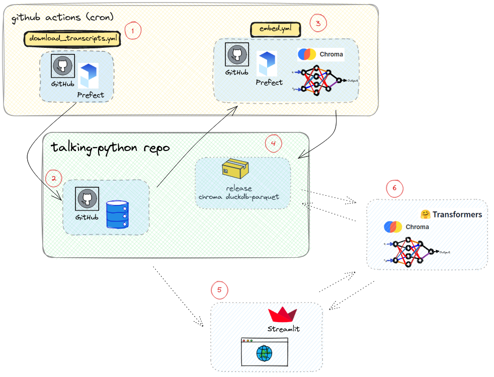

<h1 align="center">Explore Talk Python To Me</h1>

If you don't already know [Talk Python To Me](https://talkpython.fm/) maybe you should visit its page first, and take a look at its [episodes](https://talkpython.fm/episodes/all).

Already done? Then you can take a look at the demo app at [explore-talk-python-to-me](https://explore-talk-python-to-me.streamlit.app/),  or take a look at the short video demo on the *How it works* section.

[](https://explore-talk-python-to-me.streamlit.app/)

<details>
  <summary> 🎬 See a demo here </summary>
  <hr>

https://github.com/plaguss/talking-python/assets/56895847/0891c67d-2a36-4ffe-bdb3-83986575d319

</details>

This repository contains all the code behind the demo app *explore-talk-python-to-me*, a demo of how to look for episodes related to your preferences using natural language. Here you can read the code and an explanation on whats behind the app, including things like how to embed the podcast's episodes, the prefect flows to update the contents as new episodes are added, and the final streamlit app.

Table Of Content

- [How it works](#how-it-works)

    - [Prefect Flows](#prefect-flows)

    - [talking-python repo and the vector store](#talking-python-repo-and-the-vector-store)

    - [App](#app)

        - [Advanced settings](#advanced-settings)

    - [Deployment](#deployment)

- [Model behind the app](#model-behind-the-app)

- [Running the app](#prefect-flows)

- [Inspiration](#inspiration)

- [Further Steps](#further-steps)

---

## How it works

To explore the different parts, lets start from the following figure representing the architecture:



The first task is obtaining the episodes' transcriptions, which Michael Kennedy is kind enough to offer on [talk-python-transcripts](https://github.com/talkpython/talk-python-transcripts). 

### Prefect flows

On a weekly basis (the frequency of new episodes in the podcast), new episodes are added to *this* repository. We can keep *talk-python-transcripts* as a *git submodule* and pull the contents regularly using cron on a github action, as can be seen in `download-transcripts.yml`. Two prefect flows are run every  week through github actions:

- [`download-transcripts.yml`](./.github/workflows/download_transcripts.yml)

    This github action, which corresponds to the *point 1)* in the figure, is in charge of running the prefect flow [clean_transcripts.py](./flows/clean_transcripts.py). There we download the
    transcripts found in the submodule, *clean* the content (some simple preprocessing to remove unnecessary content for the final embeddings[^1]), and add the new files in the `/flow_results` for posterior use
    (the repository itself works as storage, *point 2)*).

After this, a second GitHub action runs the second prefect flow:

- [`embed.yml`](./.github/workflows/embed.yml)

    This github action is in charge of running the prefect flow in [embed.py](./flows/embed.py), 5 minutes after *download_transcripts.yml* and with the same frequency (*point 3)*). It downloads the latest chroma database released, embeds the new episodes that were added since the last run, and releases the new chroma database to the github's repo releases.

[^1]: There is an error in the code and some transcripts are not being properly processed yet!.

### `talking-python` repo and the vector store

This repository works as a datastore in two ways:

- When the first flow is run, some contents are stored in [`/flow_results`](./flow_results/) folder. The cleaned transcripts are added (they are a processed version of the original transcripts to simplify the embedding, the content that is really embedded in *point 3)*), and a txt file (.embedded_files.txt) to keep track of the already embedded episodes. This corresponds to the *point 2)* in the figure.

- After running the second *flow* *(point 3)*), the embedded episodes are stored locally using the default format provided by *chroma*. To store and share the data two (free) options came to mind. The first, git LFS was discarded due to the [limits](https://docs.github.com/en/repositories/working-with-files/managing-large-files/about-storage-and-bandwidth-usage) it imposes. Another one, inspired by [*Explosion's*](https://explosion.ai/) [spacy models](https://github.com/explosion/spacy-models), uses github release assets to store its models, and the contents of the chroma database aren't much different to those of a deep learning model, so this seemed like a good choice for this use case.

So at the end of the second flow, the chroma database content is compressed and uploaded to GitHub [releases](https://github.com/plaguss/talking-python/releases) in the repository.

We can [deploy chroma](https://docs.trychroma.com/deployment), but this is a simple demo, so I had to come up with something simpler (and cheaper). Instead, the chroma content is persisted as [parquet in disk](https://docs.trychroma.com/usage-guide#initiating-a-persistent-chroma-client), released to github as a compressed asset, and when we want to make queries to the data we can download the vector store and keep it at hand locally, just like we would do with any deep learning model. It allows us to keep track of the last chroma checkpoint (even though we will always be interested in the last release, which includes all the episodes up to the day of the last run).

### App

The app is built using [*streamlit*](https://streamlit.io/) (*point 5)*), the code can be seen in the [`app`](./app/) folder. The layout is *heavily* inspired by [KnowledgeGPT](https://knowledgegpt.streamlit.app/).

To start using the app, the first thing we must do is insert a Hugging Face API token. You have to get an [account](https://huggingface.co/join) in Hugging Face (if you don't have one yet, its simple and free) and get an [access token](https://huggingface.co/settings/tokens) to use the [inference API](https://huggingface.co/inference-api). 

Now its just a matter of asking some question about the episodes' contents (some examples are given in the sidebar's FAQ). The question will be embedded using the inference API (*point 6)*), and chroma does its magic to find the episodes that are more likely to talk about the content you asked about. It extracts the table of episodes from [talk python to me](https://talkpython.fm/episodes/all), and shows the subset of episodes sorted from most to less similar.

#### Advanced settings

You can see an expander section to play with two different fields.

- `maximum number of episodes`.

    It limits the number of passages (pieces or lines of a given episode) to gather from the database (sorted from smallest to biggest distance).

- `aggregating function`.

    The results from querying chroma are in the form of different passages that pertain to different (or the same) episodes, these results must be aggregated to offer just the list of relevant episodes for the user. Three different functions are available, but the default function should yield the best results. 

For more information take a look at the *Model behind the embeddings* section.

### Deployment

[Streamlit cloud](https://streamlit.io/cloud) offers free deployment for demo apps, its hard to beat that :) . We just have to prepare the data for streamlit cloud to find it.

Streamlit will look for a [*requirements.txt*](./requirements.txt) at the root of the repo, and we have two different internal libraries, so some unusual process must be done to go the streamlit way vs for example installing the libraries inside a Docker container. [Pip](https://pip.pypa.io/en/latest/reference/requirements-file-format/) allows us to install libraries directly from specific local distributions, so the libraries can be prebuilt and stored locally:

To build the UI code:

```bash
python -m build app --outdir=streamlit-dir/app
``` 

and the library:

```bash
python -m build src --outdir=streamlit-dir/src
``` 

Then streamlit will look at the [requierments.txt](./requirements.txt) at the root of the repo to install the dependencies. Once the app is succesfully uploaded to streamlit, the new changes are automatically redeployed.

## Model behind the app

The transcripts of the episodes are long enough to embed all the content at once (13.000 words on average), so instead of embedding the whole episodes, a different route was taken. 

Lets take a look at a piece of the transcription of episode `419-pystack.txt` as an example:

```diff
...
- 00:01:29 And it's brought to you by Compiler from Red Hat.
-
- 00:01:31 Listen to an episode of their podcast as they demystify the tech industry over at talkpython.fm/compiler.
-
- 00:01:36 Hey, Pablo.
-
- 00:01:37 Hey, Matt.
-
- 00:01:38 Great to have you both here.
...
```

Which after the preprocessing (cleansing) becomes the following:

```diff
...
+ And it's brought to you by Compiler from Red Hat.
+ Listen to an episode of their podcast as they demystify the tech industry over at toppython.fm/compiler.
+ Hey, Pablo.
+ Hey, Matt.
+ Great to have you both here.
...
```

We can embed each line (a turn in the conversation, or a *passage*) and store the reference of the episode it occurred at. The model chosen is sentence transformer's [multi-qa-MiniLM-L6-cos-v1](https://huggingface.co/sentence-transformers/multi-qa-MiniLM-L6-cos-v1) (take a look at the [intended uses](https://huggingface.co/sentence-transformers/multi-qa-MiniLM-L6-cos-v1#intended-uses) section for background on its intended use). Its open source, integrated with [chroma](https://docs.trychroma.com/embeddings#sentence-transformers) (the open source embedding database), and [hugging face's](https://github.com/chroma-core/chroma/blob/main/chromadb/utils/embedding_functions.py#L140) inference API.

From the user perspective, the interaction with the model occurs when a query is made (*point 6)* in the figure), when it is embedded using the [Hugging Face inference API](https://huggingface.co/inference-api), thats why you must supply the required api token.

After making a query, the response we obtain is formed by passages of the episodes, so to supply the table of episodes instead of the corresponding passages the response must be aggregated. Just 3 aggregation forms are used (these correspond to the `aggregating_function` expander in the app): `raw` (which returns the episodes each passage corresponds to), `minimum` (returns the episodes without repetitions, sorted by the minimun distance to the query), and the `sum weighted` option. This last function is the default (and maybe a bit more sensible than the others). When computing the distances between the query and the passages, it may occur that a single passage is very similar to the query made, then showing an episode that maybe is not that much similar. By using the sum passages weighted by the distance, we are trying to take into account this effect, and reward episodes which have more passages with similar content to the query made.

## Running the app

In case streamlit cloud is not working by any reason, or if you want to test on your own, take a look at your preferred way: 

<details><summary> With Docker </summary><hr>

It can be built using docker directly:

```bash
docker build -t talking-python . && docker run -p 8501:8501 -it talking-python
```

Or if you prefer docker compose:

```bash
docker compose up --build
```

Visit the url that streamlit shows you in the console.

</details>

<details><summary> Without Docker </summary><hr>

Basically we are going to follow the steps in the `Dockerfile` here (*use a virtual environment*).

Install the dependencies (all the contents are contained in `/src` and `/app` folders as python packages):

```bash
python -m pip install --upgrade pip
pip install src/
pip install app/
```

The first time we run the app, it will download the chroma database if it isn't found in your local system. This is done to simplify the process when using streamlit cloud. To update the content its as easy as running the following command:

```bash
python -c "from talking_python.utilities import prepare_chroma; prepare_chroma()"
```

Go to the `/app` directory, and run the following comand:

```bash
streamlit run app.py
```

You should be able to visit the url that streamlit shows you in the console.

</details>


## Inspiration

The process of embedding the episodes by embedding its different passages is kind of similar to the work shown on cohere.ai's article on wikipedia: [embedding-archives-wikipedia](https://txt.cohere.com/embedding-archives-wikipedia/), read it if you don't know it.

In this case the model used to create the embeddings is much simpler (it produces smaller vectors), and the type of text is quite different, but the approach is similar nevertheless.

## Further steps

There are a lot of things to add/improve (the first fixing the original transcripts processing), but for a demo is good enough :).
